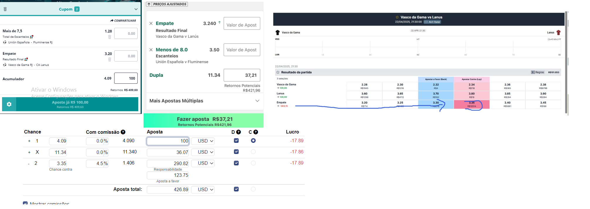

# 🧠 Prompt Engineering com Aplicações Reais – Luan Nascimento Faria

Este repositório apresenta aplicações reais de engenharia de prompt utilizadas em automações, atendimento, análise de dados e geração de textos com IA generativa.

Todos os exemplos aqui apresentados foram aplicados em ambientes reais com impacto direto em produtividade, consistência e eficiência operacional.

---

## 🔧 Tecnologias utilizadas
- GPT-4 (OpenAI)
- Python + OCR
- n8n + Integrações (WhatsApp, Google Sheets)
- Streamlit

---

## 📸 Exemplos com Demonstração

---

### 1. Atendimento Automatizado via WhatsApp

**🧠 Desafio:**  
Responder leads com agilidade, mantendo tom empático, educado e vendedor.

**🔧 Prompt Utilizado:**
```text
Aja como um atendente inteligente e simpático. Quando alguém perguntar “como funciona o grupo?”, responda com:
"Enviamos procedimentos diariamente que basta você seguir para ter lucro garantido. Aqui em nosso grupo não corremos riscos!"
Mantenha sempre cordialidade e clareza.
```

**✅ Resultado:**  
- Atendimento automatizado com taxa de resposta imediata  
- Aumento da taxa de conversão em 3x  
- Disponível 24/7 via integração com WhatsApp Business

📷 Exemplo:  


---

### 2. Validador Visual de Registros

**🧠 Desafio:**  
Verificar automaticamente se múltiplas imagens representam o mesmo evento e se os dados extraídos batem com cálculos esperados.

**🔧 Prompt Utilizado:**
```text
Compare os dados das imagens fornecidas. Verifique se os nomes dos eventos são compatíveis (mesmo time mandante e visitante), se os valores das apostas e os retornos fazem sentido segundo a imagem da calculadora.
Retorne se a verificação foi aprovada ou reprovada com justificativa.
```

**✅ Resultado:**  
- Validações automatizadas com OCR + IA  
- Redução de 90% de erros humanos  
- Agilidade no processo de conferência visual

📷 Exemplo:  


---

### 3. Geração Automatizada de Procedimento Técnico

**🧠 Desafio:**  
Transformar imagens com informações complexas em textos operacionais padronizados para distribuição em massa.

**🔧 Prompt Utilizado:**
```text
Analise a imagem enviada e extraia os dados: plataformas envolvidas, valores apostados, nome do evento, horário, e lucro ou tipo de recompensa.
Estruture a resposta no seguinte formato:
🔴 PLATAFORMAS: ...
⚽ PARTIDA: ...
🏆 RECOMPENSA: ...
🔥 APROVEITAMENTO: ...
⚠️ ATENÇÃO: ...
```

**✅ Resultado:**  
- Tempo de geração de conteúdo reduzido de horas para segundos  
- Uniformização das informações enviadas para mais de 100 usuários simultâneos  
- Economia operacional diária significativa

📷 Exemplo:  


---

## ✨ Impacto Geral

- +15 horas de trabalho manual substituídas por automação de IA  
- Processos com até 100% de consistência operacional  
- Integração com WhatsApp, OCR, automações e atendimento inteligente  
- Aplicações reais em contextos educacionais, operacionais e de suporte

---

## 📞 Contato
📧 equipeeletrofusion@gmail.com  
🔗 [LinkedIn](https://www.linkedin.com/in/luan-nascimento-faria-81370497/)
